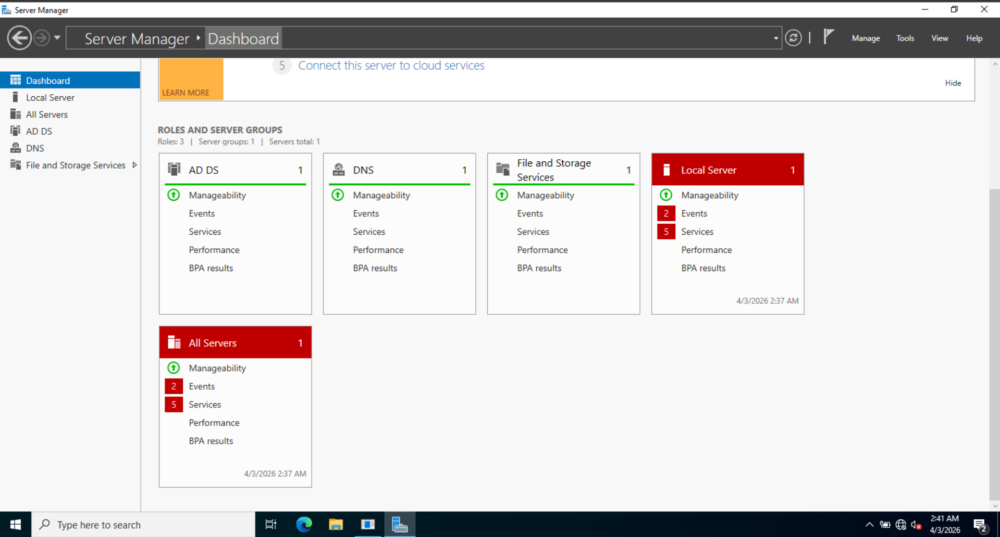
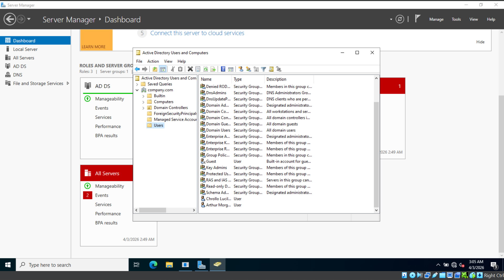

# IT Helpdesk Lab 2026

Learning IT support by building a home lab with VirtualBox, Windows Server 2022, and Windows 11.

Following along with the Kevtech IT Support series on YouTube.

---

## What I used

- Oracle VirtualBox
- Windows Server 2022
- Windows 11

---

## Part 1 - Basic Setup

- Downloaded VirtualBox
- Downloaded Windows Server 2022 ISO from Microsoft
- Downloaded Windows 11 using the Media Creation Tool
- Created a VM with 2 CPUs and 8GB RAM
- Installed Windows Server 2022 with the Desktop Experience so it has a GUI
- Tinkered with personal settings

---

## Part 2 - Active Directory & Domain Controller Setup

- Renamed server to NJ-DC-01 (New Jersey - Domain Controller - 01)
- Installed AD DS and required features via Server Manager
- Promoted the server to a Domain Controller and created a new forest with the root domain company.com
- Used PowerShell (Install-ADDSForest) to configure DNS, database paths, and SYSVOL
- Encountered an initial failure, resolved by restarting and re-running the promotion
- Logged back in as COMPANY\Administrator and verified the domain structure in Active Directory Users and Computers

---

## Part 3 - Guest Additions & Active Directory Users

- Resolved an unexpected startup issue by restarting the VM
- Installed VirtualBox Guest Additions for better VM performance and integration
- Created a shared folder between the host machine and VM named helpdesklab
- Created user accounts in Active Directory Users and Computers
- Practiced basic AD user management, including password resets, account unlocks, logon hour restrictions, personal information changing, etc.

---

## Part 4 - Windows 11 Install & Domain Join

- Created a new VM for Windows 11 Pro with 4 CPUs and 8GB RAM
- Switched Graphics Controller to VBoxSVGA and bumped Video Memory to 128MB to fix black screen boot issues
- Switched both VMs to an Internal Network named lab-net to resolve networking errors
- Manually configured IPv4 on Windows 11:
  - IP: 10.1.10.3
  - Subnet: 255.0.0.0
  - DNS: 10.1.10.2 (pointing to the Domain Controller)
- Successfully joined the Windows 11 machine to the company.com domain
- Verified domain login as amorgan and clucifer
- Logged into Windows 11 as amorgan and used RDP to log into the Server (10.1.10.2) using the Administrator credentials

---
